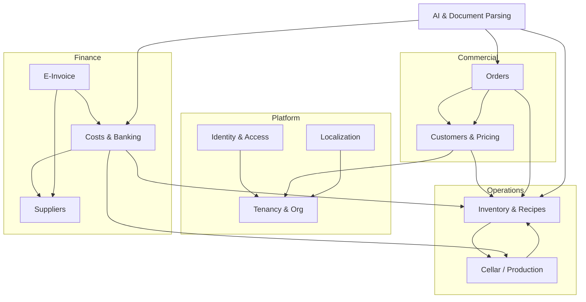

# 02 — Modules (Bounded Contexts)

The app decomposes into **8 modules** plus a cross-cutting **Platform/Tenancy**
module introduced for the SaaS rebuild. Each is independently consumable: a
clear public API, owned tables, and explicit dependencies on other modules.

> Note the deliberate **bidirectional** link between Inventory and Cellar:
> bottling writes finished stock into Inventory, and recipes can consume a wine
> lot which auto-creates a `RAW_MATERIAL` inventory item mirroring lot volume.

---

## 0. Platform / Tenancy *(new for SaaS)*

**Purpose:** Tenant lifecycle, organization settings, per-tenant secrets
(e-invoice credentials, AI keys, storage prefix), subscription/plan.

- **Owns:** `tenants`, `tenant_settings`, `tenant_secrets`, `plans`, `subscriptions`.
- **Provides:** tenant resolution middleware, global query scope, secret vault.
- **Consumes:** nothing (root of the dependency graph).

## 1. Identity & Access (IAM)

**Purpose:** Authentication, users, roles, sessions, password hashing.

- **Owns:** `users`, role assignments.
- **Source today:** `src/lib/auth.ts`, `src/lib/auth-guard.ts`, `src/actions/auth.actions.ts`, `src/types/index.ts`.
- **Key rules:** bcrypt cost 12; roles comma-separated (`ADMIN/TEAM/CELLAR/ORDERS`); cannot delete self; cannot delete a user with orders.
- **Provides:** `current_user`, `requireRole()` equivalent (Policies/Gates).

## 2. Customers & Pricing

**Purpose:** B2B customer records, pricing tiers, customer/tier price overrides,
rebates, order tokens, customer analytics.

- **Owns:** `customers`, `pricing_tiers`, `tier_prices`, `customer_prices`.
- **Source today:** `customers.actions.ts`, `pricing.actions.ts`, `src/lib/pricing.ts`.
- **Critical algorithm:** the **price-resolution precedence** — see [`05-pricing-engine.md`](05-pricing-engine.md).
- **Provides:** `resolvePrice(customer, item)`, `resolvePricesForCustomer(...)`, order-token issue/revoke.
- **Consumes:** Inventory (item ids, default prices).

## 3. Inventory & Recipes

**Purpose:** Products and materials catalog (FINISHED / SEMI_FINISHED /
RAW_MATERIAL), stock levels, stock movements ledger, images/tech sheets,
bills-of-material (recipes), production, inventory counts.

- **Owns:** `inventory_items`, `inventory_images`, `inventory_tech_sheets`, `recipe_items`, `stock_movements`.
- **Source today:** `inventory.actions.ts`, `recipe.actions.ts`, `inventory-queries.ts`, `product-matcher.ts`.
- **Key rules:** SKU unique per tenant; soft-delete if referenced by orders; unit conversion bottles↔cases on edit; COGS via `cost_per_unit` or recipe roll-up; movement types `MANUAL_IN/OUT, ORDER_DEDUCT, PRODUCTION_IN/OUT, ADJUSTMENT`.
- **Provides:** stock ledger, sellable items, recipe cost calc, product fuzzy-matcher.
- **Consumes:** Cellar (wine lots as recipe inputs).

## 4. Cellar / Production

**Purpose:** Wine production: vessels, wine lots, vessel allocation, transfers
(rack/blend/split), additions, lab analyses, tasting notes, bottling, cellar map.

- **Owns:** `vessels`, `wine_lots`, `vessel_lots`, `cellar_transfers`, `cellar_additions`, `cellar_analyses`, `cellar_tasting_notes`, `bottlings`.
- **Source today:** `cellar.actions.ts`.
- **Key rules:** lot status `FERMENTING→AGING→READY→BOTTLED/BLENDED`; vessel status auto AVAILABLE/IN_USE; capacity checks; proportional vessel deduction on bottling; cost roll-up (grape cost + additions) → per-bottle COGS at bottling.
- **Provides:** available wine-lot inputs to Inventory recipes; finished-goods writes via bottling.
- **Consumes:** Inventory (writes finished stock + stock movements; auto-creates RAW_MATERIAL mirror item).

## 5. Suppliers

**Purpose:** Supplier master data and per-supplier price lists ("learned" prices).

- **Owns:** `suppliers`, `supplier_price_items`.
- **Source today:** `suppliers.actions.ts`.
- **Key rules:** taxId (OIB) unique per tenant; deactivate-if-has-costs; price list upsert on `(supplier, description)`.
- **Provides:** supplier match/auto-create, price-list learning.

## 6. Costs & Banking

**Purpose:** Expense records (with line items + attachments), cost lifecycle,
bank statement import, duplicate detection, transaction↔cost matching, cost
analytics / P&L.

- **Owns:** `costs`, `cost_items`, `cost_attachments`, `bank_transactions`.
- **Source today:** `costs.actions.ts`, `costs-queries.ts`.
- **Key rules:** status `PENDING→APPROVED→PAID`; 3-level dedup (reference / amount±0.50€+date±5d+supplier / amount±0.02€+date±2d); category inference; supplier price-list learning on import.
- **Provides:** cost summaries, by-category/supplier, profit & loss.
- **Consumes:** Suppliers, Inventory & Cellar (cost line items can link to items/lots).

## 7. E-Invoice (Moj-eRačun)

**Purpose:** Sync incoming/outgoing e-invoices from the Croatian Moj-eRačun
network and auto-convert incoming invoices into costs.

- **Owns:** `e_invoices`.
- **Source today:** `e-racun.actions.ts`, `src/lib/e-racun-client.ts`.
- **Key rules:** statuses 10/20/30/40/45/50; processStatus 0/1/2/3/4/99; OIB-first supplier resolution; UBL XML fetch & parse; status→cost-status mapping; auto cost creation.
- **Provides:** inbox/outbox sync (scheduled + manual), connection test.
- **Consumes:** Costs, Suppliers. **Per-tenant credentials** (see Platform).

## 8. AI & Document Parsing

**Purpose:** Use Anthropic Claude to parse bank statements, supplier
receipts/invoices, and order screenshots into structured data; suggest cost
categories; compress & store uploads.

- **Owns:** no tables (stateless services); writes via other modules.
- **Source today:** `src/app/api/parse-*`, `upload*`, `suggest-category` route handlers.
- **Models:** Haiku (`claude-haiku-4-5-20251001`) for screenshots/statements/category; Sonnet for receipts/invoices. *(Re-evaluate to current models on rebuild — see `07-integrations.md`.)*
- **Provides:** parse endpoints returning structured JSON + fuzzy matches.

## 9. Localization *(cross-cutting)*

**Purpose:** DB-backed translation overrides per locale, default `hr`.

- **Owns:** `translation_overrides`.
- **Source today:** `translations.actions.ts`, `src/lib/i18n*`.
- **Key rules:** unique `(locale, key)` → make it `(tenant_id, locale, key)`; admin-only writes; cache reset on change.