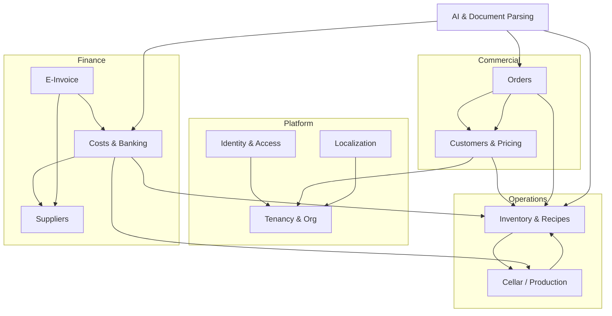

# 02 — Modules (Bounded Contexts)

The app decomposes into **8 modules** plus a cross-cutting **Platform/Tenancy**
module introduced for the SaaS rebuild. Each is independently consumable: a
clear public API, owned tables, and explicit dependencies on other modules.

> Note the deliberate **bidirectional** link between Inventory and Cellar:
> bottling writes finished stock into Inventory, and recipes can consume a wine
> lot which auto-creates a `RAW_MATERIAL` inventory item mirroring lot volume.

---

## 0. Platform / Tenancy *(new for SaaS)*

**Purpose:** Tenant lifecycle, organization settings, per-tenant secrets
(e-invoice credentials, AI keys, storage prefix), subscription/plan.

- **Owns:** `tenants`, `tenant_settings`, `tenant_secrets`, `plans`, `subscriptions`.
- **Provides:** tenant resolution middleware, global query scope, secret vault.
- **Consumes:** nothing (root of the dependency graph).

## 1. Identity & Access (IAM)

**Purpose:** Authentication, users, roles, sessions, password hashing.

- **Owns:** `users`, role assignments (in the rebuild: `memberships`, `invitations`).
- **Source today:** `src/lib/auth.ts`, `src/lib/auth-guard.ts`, `src/actions/auth.actions.ts`, `src/types/index.ts`.
- **Key rules:** bcrypt cost 12; cannot delete self; cannot delete/suspend the last admin; cannot delete a user with orders.
- 🆕 **Role set widened** to 11 values (`ADMIN, TEAM, CELLAR, ORDERS, MANAGER, SALES, HOSPITALITY, KITCHEN, EMPLOYEE, WINE_CLUB, INVENTORY`) — the Laravel `TenantRole` enum has only the first 4 and must be extended.
- 🆕 **Per-user order permission flags** — `can_edit_orders` (edit past the 1-hour window) and `can_see_shipped_orders`. In the multi-tenant model these belong on the **membership**, not the global user.
- 🆕 **Financial visibility** — `canSeeFinancials()` gates margin/cost fields to `ADMIN, TEAM, MANAGER, SALES, ORDERS`.
- **Provides:** `current_user`, `requireRole()` equivalent (Policies/Gates).

## 2. Customers & Pricing

**Purpose:** B2B customer records, pricing tiers, customer/tier price overrides,
rebates, order tokens, customer analytics.

- **Owns:** `customers`, `pricing_tiers`, `tier_prices`, `customer_prices`, 🆕 `customer_product_overrides`.
- **Source today:** `customers.actions.ts`, `pricing.actions.ts`, `customer-consignment.actions.ts`, `src/lib/pricing.ts`.
- **Critical algorithm:** the **price-resolution precedence** — see [`05-pricing-engine.md`](05-pricing-engine.md).
- **Provides:** `resolvePrice(customer, item)`, `resolvePricesForCustomer(...)`, order-token issue/revoke.
- **Consumes:** Inventory (item ids, default prices).
- 🆕 **Now also covers (post-snapshot):**
  - **OIB/VAT + VIES lookup** — `oib` column; a lookup endpoint auto-fills name/address from the EU VIES service.
  - **Reorder radar** — median-gap churn detection over a customer's order history; `reorder_contacted_at` mutes a contacted account until its next order.
  - **Customer merge** — fold duplicate customers, reassigning child rows and dropping unique-key collisions.
  - **Per-customer catalog overrides** — `customer_product_overrides` show/hide items in a specific portal.
  - **Customer-level consignment (komisija)** — aggregate placed/sold/returned and realized revenue across that customer's consignment orders (FIFO across placements). The order-level mechanics live in the **Orders** module.
  - **Agency pricing** (`is_agency`) — a hospitality price book; treat as part of the (out-of-scope) Hospitality module, but keep the `is_agency` flag.

## 3. Inventory & Recipes

**Purpose:** Products and materials catalog (FINISHED / SEMI_FINISHED /
RAW_MATERIAL), stock levels, stock movements ledger, images/tech sheets,
bills-of-material (recipes), production, inventory counts.

- **Owns:** `inventory_items`, `inventory_images`, `inventory_tech_sheets`, `recipe_items`, `stock_movements`.
- **Source today:** `inventory.actions.ts`, `recipe.actions.ts`, `inventory-queries.ts`, `inventory-spend.ts`, `product-matcher.ts`.
- **Key rules:** SKU unique per tenant; soft-delete if referenced by orders; unit conversion bottles↔cases on edit; COGS via `cost_per_unit` or recipe roll-up; movement types `MANUAL_IN/OUT, ORDER_DEDUCT, PRODUCTION_IN/OUT, ADJUSTMENT`.
- **Provides:** stock ledger, sellable items, recipe cost calc, product fuzzy-matcher.
- **Consumes:** Cellar (wine lots as recipe inputs).
- 🆕 **Now also covers (post-snapshot):**
  - **Overdraw guard** — order deductions lock the item row (`SELECT … FOR UPDATE`) and **refuse to drive stock negative**; insufficient stock raises a clear error (use a backorder instead). Backorders skip deduction by design.
  - **Stocktake reconciliation** — inventory checks write `ADJUSTMENT` movements flagged `is_reconciliation = true`; reconciliation rows are **excluded** from spend/COGS/exit analytics.
  - **ORDER_DEDUCT → live-qty reconciliation** — spend reports scale each order's recorded `ORDER_DEDUCT` down to the order's *current* line quantity, so editing an order doesn't double-count exits (self-healing, no migration).
  - **Self-service catalog fields** — `hide_from_portal`, `sales_unit`, `unit_size`, `pack_size`, and vintage grouping via `base_product_id`/`is_auto_created`.
  - **Custom recipe lines** — `recipe_items` may carry a `custom_name`/`custom_cost`/`custom_unit` with a null `input_id`.

## 3a. Orders *(documented; not yet built in Laravel)* 🆕

**Purpose:** B2B sales orders — internal capture, public self-service, AI
screenshot capture, and **consignment (komisija)** placements — with stock
deduction, COGS snapshotting, status lifecycle, comments, and notifications.

- **Owns:** `orders`, `order_items`, `order_status_histories`, `order_notes`, `consignment_reports`, `consignment_report_items`.
- **Source today:** `orders.actions.ts`, `public-order.actions.ts`, `consignment.actions.ts`, `orders-analytics.ts`, `api/parse-order-screenshot`, `api/cron/stale-orders`.
- **Key rules:**
  - Stock deducts on create/add (unit-converted, overdraw-guarded) — **unless** backorder.
  - **COGS snapshot** per line at order time (item `cost_per_unit` or recipe roll-up); frozen against later cost changes.
  - Status `RECEIVED → IN_PROCESS → READY_TO_SHIP → SHIPPED`; every change appends an `order_status_history` row.
  - **Public token** orders re-resolve prices server-side and reject client tampering; rate-limited; attributed to a system/admin user.
  - **Consignment**: placement deducts stock but is not a sale; revenue/COGS recognized on `SALE` reports; `RETURN` reports restock; delete restores only the unsold remainder.
  - **Edit window**: non-admins without `can_edit_orders` may edit a line for 1 hour; shipping cost & COGS edits are exempt.
  - **Shipping** (`shipping_cost`, `shipping_paid_by_us`) optionally folds into margin.
  - A **stale-order** job nudges unshipped orders idle > 24h (deduped via `last_stale_notified_at`).
- **Provides:** order CRUD, status transitions, consignment reconciliation, profitability analytics.
- **Consumes:** Customers (price resolution, tokens), Inventory (stock ledger, COGS), Notifications, AI (screenshot parse).

> Full spec: [`flows/01-order-internal.md`](flows/01-order-internal.md),
> [`flows/02-order-public-token.md`](flows/02-order-public-token.md),
> [`flows/03-order-from-screenshot.md`](flows/03-order-from-screenshot.md),
> [`flows/10-order-consignment.md`](flows/10-order-consignment.md). Build order:
> [`11-backend-implementation-plan.md`](11-backend-implementation-plan.md).

## 4. Cellar / Production

**Purpose:** Wine production: vessels, wine lots, vessel allocation, transfers
(rack/blend/split), additions, lab analyses, tasting notes, bottling, cellar map.

- **Owns:** `vessels`, `wine_lots`, `vessel_lots`, `cellar_transfers`, `cellar_additions`, `cellar_analyses`, `cellar_tasting_notes`, `bottlings`.
- **Source today:** `cellar.actions.ts`.
- **Key rules:** lot status `FERMENTING→AGING→READY→BOTTLED/BLENDED`; vessel status auto AVAILABLE/IN_USE; capacity checks; proportional vessel deduction on bottling; cost roll-up (grape cost + additions) → per-bottle COGS at bottling.
- **Provides:** available wine-lot inputs to Inventory recipes; finished-goods writes via bottling.
- **Consumes:** Inventory (writes finished stock + stock movements; auto-creates RAW_MATERIAL mirror item).

## 5. Suppliers

**Purpose:** Supplier master data and per-supplier price lists ("learned" prices).

- **Owns:** `suppliers`, `supplier_price_items`.
- **Source today:** `suppliers.actions.ts`.
- **Key rules:** taxId (OIB) unique per tenant; deactivate-if-has-costs; price list upsert on `(supplier, description)`.
- **Provides:** supplier match/auto-create, price-list learning.

## 6. Costs & Banking

**Purpose:** Expense records (with line items + attachments), cost lifecycle,
bank statement import, duplicate detection, transaction↔cost matching, cost
analytics / P&L.

- **Owns:** `costs`, `cost_items`, `cost_attachments`, `bank_transactions`.
- **Source today:** `costs.actions.ts`, `costs-queries.ts`.
- **Key rules:** status `PENDING→APPROVED→PAID`; 3-level dedup (reference / amount±0.50€+date±5d+supplier / amount±0.02€+date±2d); category inference; supplier price-list learning on import.
- **Provides:** cost summaries, by-category/supplier, profit & loss.
- **Consumes:** Suppliers, Inventory & Cellar (cost line items can link to items/lots).

## 7. E-Invoice (Moj-eRačun)

**Purpose:** Sync incoming/outgoing e-invoices from the Croatian Moj-eRačun
network and auto-convert incoming invoices into costs.

- **Owns:** `e_invoices`.
- **Source today:** `e-racun.actions.ts`, `src/lib/e-racun-client.ts`.
- **Key rules:** statuses 10/20/30/40/45/50; processStatus 0/1/2/3/4/99; OIB-first supplier resolution; UBL XML fetch & parse; status→cost-status mapping; auto cost creation.
- **Provides:** inbox/outbox sync (scheduled + manual), connection test.
- **Consumes:** Costs, Suppliers. **Per-tenant credentials** (see Platform).

## 8. AI & Document Parsing

**Purpose:** Use Anthropic Claude to parse bank statements, supplier
receipts/invoices, and order screenshots into structured data; suggest cost
categories; compress & store uploads.

- **Owns:** no tables (stateless services); writes via other modules.
- **Source today:** `src/app/api/parse-*`, `upload*`, `suggest-category` route handlers.
- **Models:** Haiku (`claude-haiku-4-5-20251001`) for screenshots/statements/category; Sonnet for receipts/invoices. *(Re-evaluate to current models on rebuild — see `07-integrations.md`.)*
- **Provides:** parse endpoints returning structured JSON + fuzzy matches.

## 9. Localization *(cross-cutting)*

**Purpose:** DB-backed translation overrides per locale, default `hr`.

- **Owns:** `translation_overrides`.
- **Source today:** `translations.actions.ts`, `src/lib/i18n*`.
- **Key rules:** unique `(locale, key)` → make it `(tenant_id, locale, key)`; admin-only writes; cache reset on change.

## 10. Notifications *(cross-cutting)* 🆕

**Purpose:** In-app "bell" feed plus browser-push and WhatsApp transports for
order events (new order, status change, comment reply, @mention).

- **Owns:** `notifications` (+ a push-subscription table for Web Push).
- **Source today:** `src/lib/notifications.ts`, `src/lib/push.ts`, `api/push-subscribe`, `api/cron/stale-orders`.
- **Key rules:** recipients = order role-holders + order followers (creator + commenters); @mention → directed `MENTION`; transports are best-effort (failures swallowed).
- **Consumes:** Orders (events), IAM (recipients).
- **Backend scope:** persist the feed + emit events; Web Push/WhatsApp delivery can be deferred.

## 11. Employees / HR *(not yet migrated — separate module)* 🆕

> The source app's `dashboard/employees/**` is a **distinct HR domain**, separate
> from IAM "team/members". It is **out of scope for the current backend pass** but
> noted here so it isn't mistaken for an IAM gap.

- **Would own:** `employees`, `employee_daily_logs`, `employee_time_logs`, `employee_schedules`, `employee_development_plans`, `satisfaction_surveys`, `survey_questions`, `satisfaction_responses`.
- **Source today:** `employee.actions.ts`, `dashboard/employees/**`, `employee-hours/[token]`.
- **Covers:** employee directory, salary, weekly schedules, daily/weekly hour logs + balance, token-based self-serve hours portal, development plans, satisfaction surveys.