# 03 — Entity & Relationship Data Model

This is the complete database design for the Laravel rebuild, derived from
`prisma/schema.prisma`, with multi-tenancy added.

- Every business table gains **`tenant_id`** (FK → `tenants.id`, indexed, NOT NULL).
- Uniqueness that was global in the source becomes **scoped to the tenant**
  (e.g. `inventory_items.sku` → unique `(tenant_id, sku)`). These are flagged below.
- Primary keys: ULID/UUID strings (current app uses `cuid`).
- `created_at` / `updated_at` on all tables.

## 3.1 Entity Relationship Diagram (full)

```mermaid
erDiagram
    TENANT ||--o{ USER : has
    TENANT ||--o{ CUSTOMER : has
    TENANT ||--o{ INVENTORY_ITEM : has
    TENANT ||--o{ VESSEL : has
    TENANT ||--o{ WINE_LOT : has
    TENANT ||--o{ SUPPLIER : has
    TENANT ||--o{ COST : has
    TENANT ||--o{ ORDER : has
    TENANT ||--o{ E_INVOICE : has
    TENANT ||--|| TENANT_SETTING : configures

    USER ||--o{ ORDER : "created"
    USER ||--o{ ORDER_STATUS_HISTORY : changed
    USER ||--o{ ORDER_NOTE : authored
    USER ||--o{ STOCK_MOVEMENT : recorded
    USER ||--o{ COST : created
    USER ||--o{ CELLAR_TRANSFER : performed
    USER ||--o{ CELLAR_ADDITION : performed
    USER ||--o{ CELLAR_ANALYSIS : performed
    USER ||--o{ CELLAR_TASTING_NOTE : performed
    USER ||--o{ BOTTLING : performed

    PRICING_TIER ||--o{ CUSTOMER : groups
    PRICING_TIER ||--o{ TIER_PRICE : "price book"
    CUSTOMER ||--o{ CUSTOMER_PRICE : overrides
    CUSTOMER ||--o{ ORDER : places

    INVENTORY_ITEM ||--o{ TIER_PRICE : priced
    INVENTORY_ITEM ||--o{ CUSTOMER_PRICE : priced
    INVENTORY_ITEM ||--o{ INVENTORY_IMAGE : has
    INVENTORY_ITEM ||--o{ INVENTORY_TECH_SHEET : has
    INVENTORY_ITEM ||--o{ ORDER_ITEM : "sold as"
    INVENTORY_ITEM ||--o{ STOCK_MOVEMENT : ledger
    INVENTORY_ITEM ||--o{ RECIPE_ITEM : "output of"
    INVENTORY_ITEM ||--o{ RECIPE_ITEM : "input to"
    INVENTORY_ITEM ||--o{ SUPPLIER_PRICE_ITEM : quoted
    INVENTORY_ITEM ||--o{ COST_ITEM : "billed as"
    INVENTORY_ITEM ||--o{ BOTTLING : "bottled into"

    ORDER ||--o{ ORDER_ITEM : contains
    ORDER ||--o{ ORDER_STATUS_HISTORY : tracks
    ORDER ||--o{ ORDER_NOTE : has

    VESSEL ||--o{ VESSEL_LOT : holds
    WINE_LOT ||--o{ VESSEL_LOT : "stored in"
    WINE_LOT ||--o{ CELLAR_ADDITION : receives
    WINE_LOT ||--o{ CELLAR_ANALYSIS : measured
    WINE_LOT ||--o{ CELLAR_TASTING_NOTE : tasted
    WINE_LOT ||--o{ CELLAR_TRANSFER : "transfer from"
    WINE_LOT ||--o{ CELLAR_TRANSFER : "transfer to"
    WINE_LOT ||--o{ BOTTLING : bottled
    WINE_LOT ||--o{ COST_ITEM : "cost allocated"

    SUPPLIER ||--o{ SUPPLIER_PRICE_ITEM : lists
    SUPPLIER ||--o{ COST : billed
    SUPPLIER ||--o{ BANK_TRANSACTION : counterparty
    SUPPLIER ||--o{ E_INVOICE : sender

    COST ||--o{ COST_ITEM : contains
    COST ||--o{ COST_ATTACHMENT : has
    COST ||--o| BANK_TRANSACTION : "matched 1:1"
    COST ||--o| E_INVOICE : "sourced from 1:1"
```

## 3.2 Relationship map (cardinalities & cascade)

| Parent | Child | Cardinality | On delete | Notes |
|---|---|---|---|---|
| Tenant | (all business tables) | 1→N | RESTRICT | Deleting a tenant must purge/anonymize via job, not FK cascade |
| Customer | Order | 1→N | RESTRICT | Customer soft-deleted if it has orders |
| Customer | CustomerPrice | 1→N | CASCADE | |
| PricingTier | Customer | 1→N (optional) | SET NULL | Customer may have no tier |
| PricingTier | TierPrice | 1→N | CASCADE | |
| InventoryItem | TierPrice / CustomerPrice | 1→N | CASCADE | |
| InventoryItem | OrderItem | 1→N | RESTRICT | Item soft-deleted if referenced by orders |
| InventoryItem | StockMovement | 1→N | CASCADE | |
| InventoryItem | InventoryImage / TechSheet | 1→N | CASCADE | |
| InventoryItem (output) | RecipeItem | 1→N | CASCADE | `(output_id, input_id)` unique |
| InventoryItem (input) | RecipeItem | 1→N | CASCADE | self-reference disallowed |
| Order | OrderItem | 1→N | CASCADE | |
| Order | OrderStatusHistory | 1→N | CASCADE | |
| Order | OrderNote | 1→N | CASCADE | |
| Vessel | VesselLot | 1→N | CASCADE | |
| WineLot | VesselLot | 1→N | CASCADE | one lot can be in many vessels |
| WineLot | CellarAddition/Analysis/TastingNote | 1→N | CASCADE | |
| WineLot | CellarTransfer (from/to) | 1→N | RESTRICT (manual reverse) | |
| WineLot | Bottling | 1→N | RESTRICT | bottled stock not auto-reversed |
| WineLot | InventoryItem (RAW_MATERIAL mirror) | 1→1 logical | app-managed | matched by `sku == lot_number` |
| Supplier | SupplierPriceItem | 1→N | CASCADE | `(supplier_id, description)` unique |
| Supplier | Cost | 1→N | SET NULL | |
| Supplier | BankTransaction | 1→N | SET NULL | |
| Supplier | EInvoice | 1→N | SET NULL | |
| Cost | CostItem | 1→N | CASCADE | |
| Cost | CostAttachment | 1→N | CASCADE | |
| Cost | BankTransaction | 1→1 | SET NULL | `bank_transaction_id` unique |
| Cost | EInvoice | 1→1 | SET NULL | `e_invoice.cost_id` unique |

## 3.3 Prisma model → Laravel table name map

| Prisma model | Laravel table |
|---|---|
| User | `users` |
| Customer | `customers` |
| PricingTier | `pricing_tiers` |
| TierPrice | `tier_prices` |
| CustomerPrice | `customer_prices` |
| Order | `orders` |
| OrderItem | `order_items` |
| OrderStatusHistory | `order_status_histories` |
| OrderNote | `order_notes` |
| InventoryItem | `inventory_items` |
| InventoryImage | `inventory_images` |
| InventoryTechSheet | `inventory_tech_sheets` |
| RecipeItem | `recipe_items` |
| StockMovement | `stock_movements` |
| Vessel | `vessels` |
| WineLot | `wine_lots` |
| VesselLot | `vessel_lots` |
| CellarTransfer | `cellar_transfers` |
| CellarAddition | `cellar_additions` |
| CellarAnalysis | `cellar_analyses` |
| CellarTastingNote | `cellar_tasting_notes` |
| Bottling | `bottlings` |
| Supplier | `suppliers` |
| SupplierPriceItem | `supplier_price_items` |
| Cost | `costs` |
| CostItem | `cost_items` |
| CostAttachment | `cost_attachments` |
| BankTransaction | `bank_transactions` |
| EInvoice | `e_invoices` |
| TranslationOverride | `translation_overrides` |
| — *(new)* | `tenants`, `tenant_settings`, `tenant_secrets`, `plans`, `subscriptions` |

---

## 3.4 Data dictionary

> Columns marked **🔑tenant-scoped unique** were globally unique in the source
> and must become composite-unique with `tenant_id`. All tables get
> `tenant_id` (except `tenants`, `plans`).

### tenants *(new)*
| Column | Type | Notes |
|---|---|---|
| id | ulid PK | |
| name | string | winery/business name |
| slug | string unique | subdomain / routing key |
| status | enum | `ACTIVE, SUSPENDED, TRIAL, CANCELED` |
| plan_id | fk plans | |
| default_locale | string | default `hr` |
| created_at / updated_at | timestamp | |

### tenant_settings / tenant_secrets *(new)*
Holds per-tenant config (`default_currency`, `company_oib`, storage prefix) and
**encrypted secrets**: `eracun_username`, `eracun_password`, `eracun_company_id`,
`eracun_software_id`, optional `anthropic_api_key`. Secrets encrypted at rest
(`Crypt::`), never returned in API responses.

### users
| Column | Type | Notes |
|---|---|---|
| id | ulid PK | |
| tenant_id | fk | |
| name | string | |
| email | string | **🔑tenant-scoped unique** (consider global-unique if login is email-only across tenants — see security doc) |
| hashed_password | string | bcrypt cost 12 |
| role | string | comma-separated: `ADMIN,TEAM,CELLAR,ORDERS` |
| created_at / updated_at | | |

### customers
| Column | Type | Notes |
|---|---|---|
| id | ulid PK | |
| tenant_id | fk | |
| company_name | string | |
| contact_name | string | |
| email | string | **🔑tenant-scoped unique** |
| phone, address, city, state, zip, country | string nullable | |
| notes | text nullable | |
| is_active | bool default true | soft-delete flag |
| rebate_percent | decimal(5,2) default 0 | customer-level discount override |
| exclude_from_stats | bool default false | |
| hide_prices | bool default false | hide prices in self-service catalog |
| order_token | string nullable | **globally unique** secret (32 hex). For SaaS, prefix with tenant or store tenant lookup — see flow 02 |
| pricing_tier_id | fk pricing_tiers nullable | SET NULL |

### pricing_tiers
| Column | Type | Notes |
|---|---|---|
| id | ulid PK | |
| tenant_id | fk | |
| name | string | **🔑tenant-scoped unique** |
| description | string nullable | |
| rebate_percent | decimal(5,2) default 0 | tier-level default discount |

### tier_prices
| Column | Type | Notes |
|---|---|---|
| id | ulid PK | |
| tenant_id | fk | |
| inventory_item_id | fk | |
| pricing_tier_id | fk | |
| price | decimal(14,2) | |
| | | **unique** `(inventory_item_id, pricing_tier_id)` |

### customer_prices
| Column | Type | Notes |
|---|---|---|
| id | ulid PK | |
| tenant_id | fk | |
| inventory_item_id | fk | |
| customer_id | fk | |
| price | decimal(14,2) | absolute override; rebate NOT applied |
| | | **unique** `(inventory_item_id, customer_id)` |

### orders
| Column | Type | Notes |
|---|---|---|
| id | ulid PK | |
| tenant_id | fk | |
| order_number | string | **🔑tenant-scoped unique** |
| status | enum | `RECEIVED, IN_PROCESS, READY_TO_SHIP, SHIPPED` (default `RECEIVED`) |
| total_amount | decimal(14,2) | |
| notes | text nullable | |
| customer_id | fk | RESTRICT |
| created_by_id | fk users | |

### order_items
| Column | Type | Notes |
|---|---|---|
| id | ulid PK | |
| tenant_id | fk | |
| order_id | fk | CASCADE |
| inventory_item_id | fk | |
| quantity | int | |
| unit_type | string | `bottles` (default) / `cases` |
| unit_price | decimal(14,2) | |
| total | decimal(14,2) | |
| cost_per_unit | decimal(14,2) nullable | **COGS snapshot** at order time (per display unit) |

### order_status_histories
| Column | Type | Notes |
|---|---|---|
| id | ulid PK | |
| tenant_id | fk | |
| order_id | fk | CASCADE |
| status | string | |
| note | string nullable | |
| changed_by_id | fk users | |
| created_at | | |

### order_notes
| Column | Type | Notes |
|---|---|---|
| id, tenant_id, order_id (CASCADE), content (text), author_id (fk users), created_at | | free-text thread |

### inventory_items
| Column | Type | Notes |
|---|---|---|
| id | ulid PK | |
| tenant_id | fk | |
| name | string | |
| sku | string | **🔑tenant-scoped unique** |
| description | text nullable | |
| category | enum | `FINISHED, SEMI_FINISHED, RAW_MATERIAL` |
| group | string nullable | e.g. Wine, Olive Oil, Grappa |
| subcategory | string nullable | e.g. Red Wine, White Wine |
| vintage | string nullable | |
| unit | string | bottles, cases, kg, liters, units |
| current_stock | decimal(12,3) default 0 | |
| min_stock | decimal(12,3) nullable | reorder threshold |
| is_active | bool default true | |
| sort_order | int default 0 | |
| default_price | decimal(14,2) nullable | sale price (FINISHED) |
| bottles_per_case | int default 12 | |
| is_for_sale | bool default false | catalog visibility |
| cost_per_unit | decimal(14,2) nullable | COGS per display unit |

### inventory_images / inventory_tech_sheets
`inventory_images`: id, tenant_id, inventory_item_id (CASCADE), url, alt nullable, sort_order.
`inventory_tech_sheets`: id, tenant_id, inventory_item_id (CASCADE), name, url.

### recipe_items
| Column | Type | Notes |
|---|---|---|
| id | ulid PK | |
| tenant_id | fk | |
| output_id | fk inventory_items | CASCADE |
| input_id | fk inventory_items | CASCADE |
| quantity | decimal(12,3) | input qty per 1 output (per bottle) |
| | | **unique** `(output_id, input_id)`; `output_id != input_id` |

### stock_movements
| Column | Type | Notes |
|---|---|---|
| id | ulid PK | |
| tenant_id | fk | |
| inventory_item_id | fk | CASCADE |
| type | enum | `MANUAL_IN, MANUAL_OUT, ORDER_DEDUCT, PRODUCTION_IN, PRODUCTION_OUT, ADJUSTMENT` |
| quantity | decimal(12,3) | signed |
| unit | string nullable | unit at time of recording |
| note | string nullable | |
| reference | string nullable | e.g. order number, `PROD-{sku}`, `INVCHECK-{date}` |
| created_by_id | fk users | |
| created_at | | |

### vessels
| Column | Type | Notes |
|---|---|---|
| id | ulid PK | |
| tenant_id | fk | |
| name | string | |
| type | enum | `BARREL, TANK, VAT, AMPHORA` |
| material | string nullable | oak, stainless_steel, concrete, clay |
| capacity_liters | decimal(12,3) | |
| current_volume | decimal(12,3) default 0 | |
| location | string nullable | |
| status | enum | `AVAILABLE, IN_USE, MAINTENANCE, RETIRED` (default AVAILABLE) |
| notes | string nullable | |
| is_active | bool default true | |
| position_x, position_y | int nullable | cellar map coords |
| map_width (60), map_height (80), rotation (0) | int nullable | map visuals |
| room | string nullable default "Main Cellar" | |

### wine_lots
| Column | Type | Notes |
|---|---|---|
| id | ulid PK | |
| tenant_id | fk | |
| lot_number | string | **🔑tenant-scoped unique** `LOT-{YEAR}-{NNN}` |
| name | string | |
| grape_variety | string | |
| vintage | string | |
| vineyard | string nullable | |
| initial_volume | decimal(12,3) | liters at creation (cost denominator) |
| current_volume | decimal(12,3) | liters remaining |
| status | enum | `FERMENTING, AGING, READY, BOTTLED, BLENDED` (default FERMENTING) |
| grape_cost | decimal(14,2) nullable | = grape_price_per_kg × harvest_weight_kg |
| grape_price_per_kg | decimal(14,4) nullable | |
| harvest_weight_kg | decimal(12,3) nullable | |
| notes | string nullable | |

### vessel_lots
| Column | Type | Notes |
|---|---|---|
| id | ulid PK | |
| tenant_id | fk | |
| vessel_id | fk | CASCADE |
| wine_lot_id | fk | CASCADE |
| volume | decimal(12,3) | liters of this lot in this vessel |
| added_at | timestamp | |

### cellar_transfers
| Column | Type | Notes |
|---|---|---|
| id | ulid PK | |
| tenant_id | fk | |
| type | enum | `RACK, BLEND, SPLIT` |
| volume_liters | decimal(12,3) | |
| note | string nullable | |
| from_lot_id | fk wine_lots | |
| to_lot_id | fk wine_lots | `!= from_lot_id` |
| from_vessel_id | fk vessels nullable | |
| to_vessel_id | fk vessels nullable | |
| created_by_id | fk users | |

### cellar_additions
| Column | Type | Notes |
|---|---|---|
| id, tenant_id | | |
| wine_lot_id | fk | CASCADE |
| name | string | SO2, Yeast, Bentonite… |
| category | enum nullable | `SULFITE, YEAST, NUTRIENT, FINING, ACID, ENZYME, OTHER` |
| quantity | decimal(12,3) | |
| unit | string | g, ml, kg, liters |
| cost_per_unit | decimal(14,4) nullable | |
| total_cost | decimal(14,2) nullable | quantity × cost_per_unit |
| note | string nullable | |
| created_by_id | fk users | |

### cellar_analyses
| Column | Type | Notes |
|---|---|---|
| id, tenant_id, wine_lot_id (CASCADE), created_by_id | | |
| date | timestamp | |
| ph, total_acidity, volatile_acidity, alcohol, residual_sugar, free_so2, total_so2, brix, temperature, density | decimal nullable | lab metrics |
| note | string nullable | |

### cellar_tasting_notes
| Column | Type | Notes |
|---|---|---|
| id, tenant_id, wine_lot_id (CASCADE), created_by_id | | |
| date | timestamp | |
| appearance, nose, palate, overall | string nullable | |
| score | int nullable | 0–100 |
| note | string nullable | |

### bottlings
| Column | Type | Notes |
|---|---|---|
| id | ulid PK | |
| tenant_id | fk | |
| wine_lot_id | fk | |
| inventory_item_id | fk nullable | finished product produced |
| bottle_count | int | |
| bottle_volume_ml | int default 750 | 750/375/1500 |
| volume_used | decimal(12,3) | liters consumed = count × ml / 1000 |
| date | timestamp | |
| note | string nullable | |
| created_by_id | fk users | |

### suppliers
| Column | Type | Notes |
|---|---|---|
| id | ulid PK | |
| tenant_id | fk | |
| company_name | string | |
| contact_name, email, phone, address, city, country | string nullable | |
| tax_id | string nullable | OIB — **🔑tenant-scoped unique** (used for match/auto-create) |
| bank_account | string nullable | IBAN |
| payment_terms | string nullable | |
| notes | string nullable | |
| is_active | bool default true | |

### supplier_price_items
| Column | Type | Notes |
|---|---|---|
| id | ulid PK | |
| tenant_id | fk | |
| supplier_id | fk | CASCADE |
| inventory_item_id | fk nullable | SET NULL |
| description | string | |
| unit_price | decimal(14,2) | |
| unit | string nullable | |
| notes | string nullable | |
| last_updated | timestamp | |
| | | **unique** `(supplier_id, description)` |

### costs
| Column | Type | Notes |
|---|---|---|
| id | ulid PK | |
| tenant_id | fk | |
| date | timestamp | |
| total_amount | decimal(14,2) | |
| currency | string default EUR | |
| category | string | free-form learned category |
| description | string nullable | |
| reference | string nullable | invoice/receipt number |
| status | enum | `PENDING, APPROVED, PAID` (default PENDING) |
| payment_method | string nullable | cash, bank_transfer, card |
| notes | string nullable | |
| supplier_id | fk nullable | SET NULL |
| created_by_id | fk users | |
| bank_transaction_id | fk nullable unique | SET NULL |

### cost_items
| Column | Type | Notes |
|---|---|---|
| id, tenant_id | | |
| cost_id | fk | CASCADE |
| inventory_item_id | fk nullable | SET NULL |
| wine_lot_id | fk nullable | SET NULL |
| description | string | |
| quantity | decimal(12,3) default 1 | |
| unit_price | decimal(14,2) | |
| total | decimal(14,2) | |
| category | string nullable | |

### cost_attachments
| Column | Type | Notes |
|---|---|---|
| id, tenant_id | | |
| cost_id | fk | CASCADE |
| url | string | object storage URL |
| filename | string | |
| type | enum | receipt, invoice, bank_statement, other |
| created_at | | |

### bank_transactions
| Column | Type | Notes |
|---|---|---|
| id | ulid PK | |
| tenant_id | fk | |
| date | timestamp | |
| description | string | |
| amount | decimal(14,2) | sign per type |
| currency | string default EUR | |
| type | enum | `DEBIT, CREDIT` |
| counterparty | string nullable | for supplier fuzzy match |
| reference | string nullable | |
| category | string nullable | |
| is_matched | bool default false | |
| import_batch_id | string nullable | `batch_{ts}_{rand}` |
| supplier_id | fk nullable | SET NULL |

### e_invoices
| Column | Type | Notes |
|---|---|---|
| id | ulid PK | |
| tenant_id | fk | |
| electronic_id | bigint | **🔑tenant-scoped unique** (Moj-eRačun ElectronicId) |
| direction | enum | `INCOMING` (default), `OUTGOING` |
| document_nr | string nullable | |
| document_type | string nullable | |
| status | int | 10=Preparing,20=Validating,30=Sent,40=Delivered,45=Canceled,50=Unsuccessful |
| status_name | string nullable | |
| process_status | int nullable | 0=Approved,1=Rejected,2=Paid,3=Partial,4=Confirmed,99=Received |
| sender_oib, sender_name, recipient_oib, recipient_name | string nullable | |
| invoice_date, due_date | timestamp nullable | |
| total_amount | decimal(14,2) nullable | |
| currency | string nullable default EUR | |
| xml_content | text nullable | raw UBL XML |
| sent_at, delivered_at | timestamp nullable | |
| cost_id | fk nullable unique | SET NULL |
| supplier_id | fk nullable | SET NULL |

### translation_overrides
| Column | Type | Notes |
|---|---|---|
| id | ulid PK | |
| tenant_id | fk | |
| locale | string default hr | |
| key | string | |
| value | string | |
| | | **unique** `(tenant_id, locale, key)` |

---

## 3.5 Enumerations (single reference)

| Enum | Values |
|---|---|
| User roles | `ADMIN, TEAM, CELLAR, ORDERS` (multi-valued, comma-joined) |
| Order status | `RECEIVED → IN_PROCESS → READY_TO_SHIP → SHIPPED` |
| Inventory category | `FINISHED, SEMI_FINISHED, RAW_MATERIAL` |
| Stock movement type | `MANUAL_IN, MANUAL_OUT, ORDER_DEDUCT, PRODUCTION_IN, PRODUCTION_OUT, ADJUSTMENT` |
| Vessel type | `BARREL, TANK, VAT, AMPHORA` |
| Vessel status | `AVAILABLE, IN_USE, MAINTENANCE, RETIRED` |
| Wine lot status | `FERMENTING, AGING, READY, BOTTLED, BLENDED` |
| Cellar transfer type | `RACK, BLEND, SPLIT` |
| Cellar addition category | `SULFITE, YEAST, NUTRIENT, FINING, ACID, ENZYME, OTHER` |
| Cost status | `PENDING, APPROVED, PAID` |
| Cost attachment type | `receipt, invoice, bank_statement, other` |
| Bank transaction type | `DEBIT, CREDIT` |
| E-invoice direction | `INCOMING, OUTGOING` |
| E-invoice status | `10, 20, 30, 40, 45, 50` |
| E-invoice processStatus | `0, 1, 2, 3, 4, 99` |
| Tenant status *(new)* | `ACTIVE, SUSPENDED, TRIAL, CANCELED` |