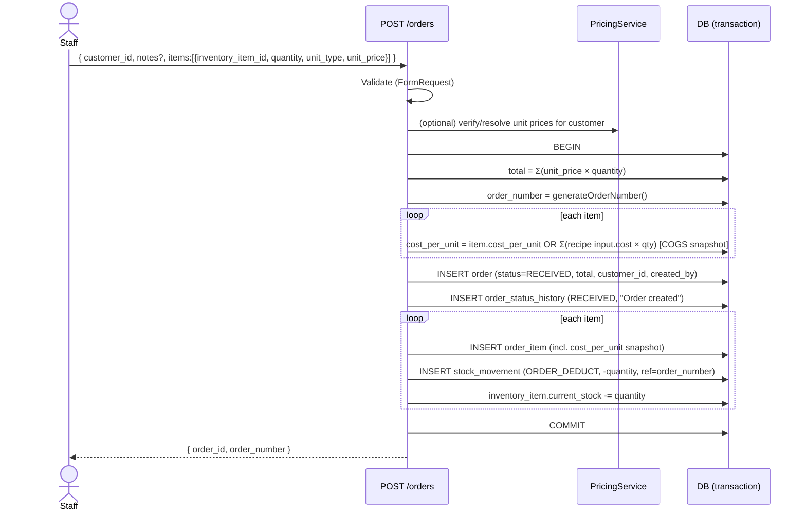
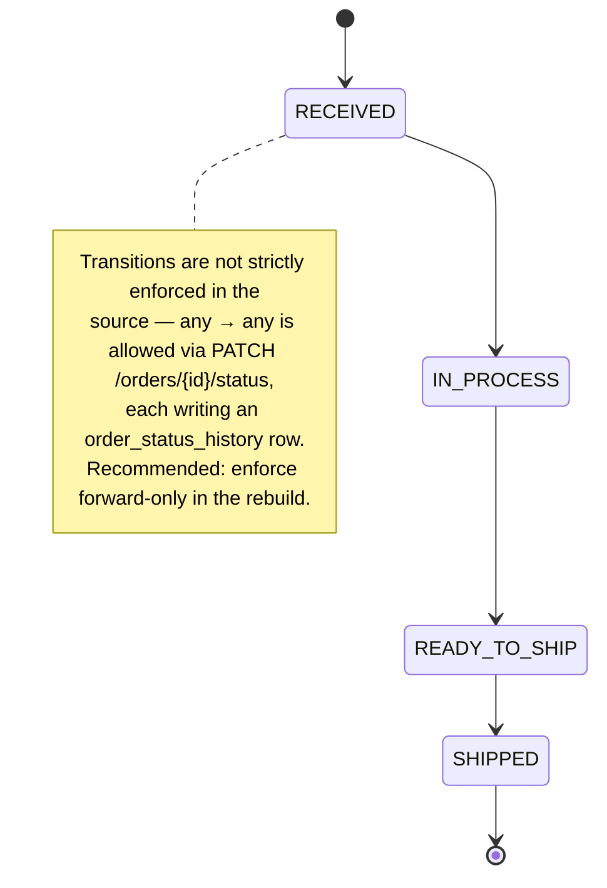

# Flow 01 — Internal Order Creation

Staff member creates an order on behalf of a customer. Source:
`orders.actions.ts → createOrder`.

## Preconditions
- Authenticated user (any role that can create orders).
- Customer exists; inventory items exist and are sellable.

## Sequence

## Side effects
- `orders` row created with status **RECEIVED**.
- One `order_status_history` row (`RECEIVED`, note "Order created").
- Per line: an `order_items` row, a **`ORDER_DEDUCT`** `stock_movements` row
  (negative), and `current_stock` decremented immediately.
- **COGS snapshot** frozen onto each line's `cost_per_unit` (from item cost or
  recipe roll-up) so margin is immune to later cost changes.

## Status lifecycle (shared by all order flows)

## Adding items later (`POST /orders/{id}/items`)
Same per-item logic: snapshot COGS, append `order_item`, `ORDER_DEDUCT`
movement, decrement stock, and **increment `order.total_amount`**.

## Deleting an order (ADMIN, `DELETE /orders/{id}`)
Restores stock: per item an **`ADJUSTMENT`** movement (positive) + `current_stock`
incremented, then the order (and its cascade children) is deleted.

## Notes for Laravel
- Wrap in a single DB transaction (the source uses Prisma `$transaction`).
- `generateOrderNumber()` should be tenant-scoped and collision-safe.
- Validate `unit_type ∈ {bottles, cases}`, `quantity ≥ 1`, `unit_price ≥ 0`.