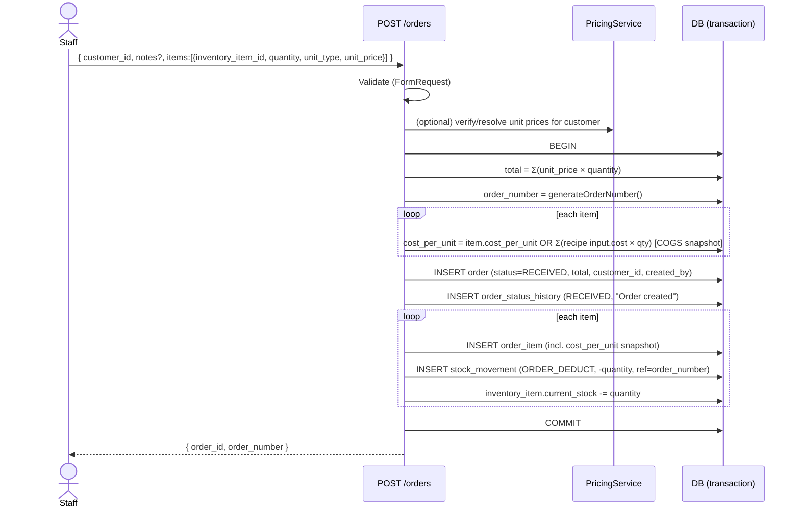
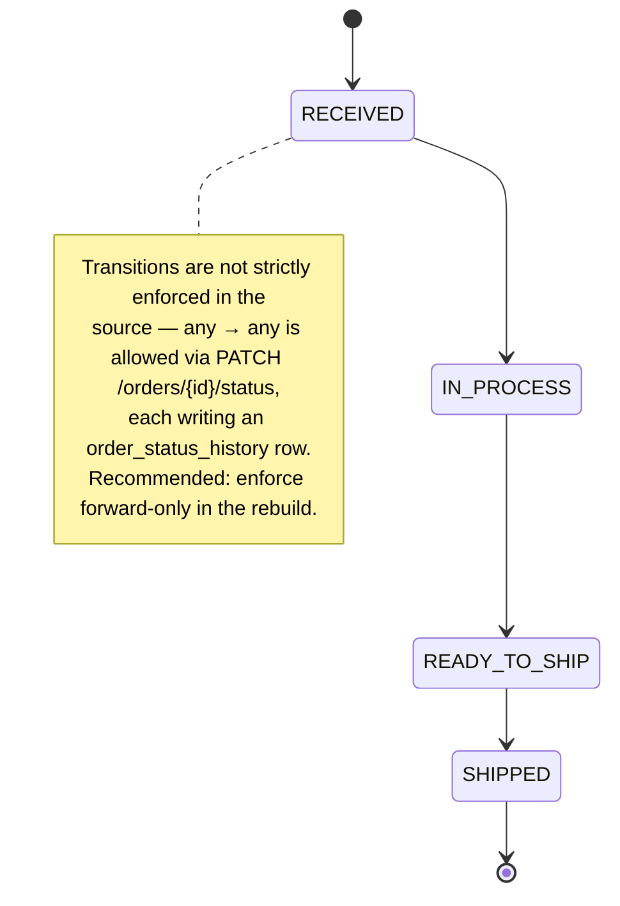

# Flow 01 — Internal Order Creation

Staff member creates an order on behalf of a customer. Source:
`orders.actions.ts → createOrder`.

## Preconditions
- Authenticated user (any role that can create orders).
- Customer exists; inventory items exist and are sellable.

## Sequence

## Side effects
- `orders` row created with status **RECEIVED**.
- One `order_status_history` row (`RECEIVED`, note "Order created").
- Per line: an `order_items` row, a **`ORDER_DEDUCT`** `stock_movements` row
  (negative), and `current_stock` decremented immediately.
- **COGS snapshot** frozen onto each line's `cost_per_unit` (from item cost or
  recipe roll-up) so margin is immune to later cost changes.

## Status lifecycle (shared by all order flows)

## Adding items later (`POST /orders/{id}/items`)
Same per-item logic: snapshot COGS, append `order_item`, `ORDER_DEDUCT`
movement, decrement stock, and **increment `order.total_amount`**.

## Deleting an order (ADMIN, `DELETE /orders/{id}`)
Restores stock: per item an **`ADJUSTMENT`** movement (positive) + `current_stock`
incremented, then the order (and its cascade children) is deleted.

## 🆕 Stock deduction details (post-snapshot)

The deduction is **not** a naive `current_stock -= quantity`:

1. **Unit conversion.** Order qty is in `unit_type` (bottles/cases) but stock is
   held in the item's storage `unit`. Convert using `bottles_per_case`
   (cases→bottles ×, bottles→cases ÷, 6-dp precision) before touching stock.
2. **Overdraw guard.** Lock the item row (`SELECT … FOR UPDATE`) and reject if the
   converted quantity exceeds `current_stock` — *no silent negative stock*. Error:
   `"Not enough stock for {item} — {available} {unit} available (need {needed}).
   Mark it a backorder if intended."`
3. **Backorder skip.** If `is_backorder = true` (or an explicit "no deduction"
   flag), **skip** the deduction and the `ORDER_DEDUCT` movement entirely; set
   `backorder_date`.

## 🆕 Order variants captured at creation

| Field | Effect |
|---|---|
| `is_backorder` + `backorder_date` | no stock deducted; `backorder_date` is the effective revenue date |
| `is_consignment` | placement, not a sale — stock **is** deducted, but the order is excluded from sales revenue (revenue comes later from `consignment_reports`; see [flow 10](10-order-consignment.md)) |
| `shipping_cost` (+ `shipping_paid_by_us`) | freight; when "paid by us", folds into margin in analytics |
| custom line (`inventory_item_id` null, `custom_description`, manual `cost_per_unit`) | non-product line (freight/service); no stock effect |
| initial `status` | staff may open an order directly in `IN_PROCESS`/etc. |

## 🆕 Notifications (fire-and-forget, best-effort)
On create (unless opening directly as `SHIPPED`): `NEW_ORDER` to order-role
holders **and the creator**; optional Web Push + WhatsApp to the customer.
On status change: `ORDER_STATUS` to followers + WhatsApp to the customer.
Failures are swallowed — never block the order transaction. See module 10.

## 🆕 Edit window
Non-admins **without** `can_edit_orders` may edit a line (qty/unit) only within
**1 hour** of creation; admins and `can_edit_orders` holders are unrestricted.
Editing `shipping_cost` and a line's `cost_per_unit` is **exempt** (invoices and
true costs arrive later). Quantity/unit edits re-run the overdraw guard and write
a compensating movement so the ledger stays consistent.

## Notes for Laravel
- Wrap in a single DB transaction (the source uses Prisma `$transaction`).
- `generateOrderNumber()` should be tenant-scoped and collision-safe.
- Validate `unit_type ∈ {bottles, cases}`, `quantity ≥ 1`, `unit_price ≥ 0`.
- Put the deduction (convert → lock → guard → move → decrement) in a single
  `StockLedger`-backed service so internal + public + consignment share it.