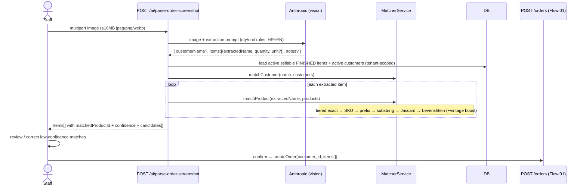

# Flow 03 — AI-Assisted Order Capture (Screenshot)

Staff pastes a WhatsApp/email screenshot; the system extracts items and
customer, fuzzy-matches them to the catalog, and pre-fills a draft order which
staff confirms (then Flow 01 runs). Source: `api/parse-order-screenshot`,
`product-matcher.ts`.

## Sequence

## Extraction parsing rules (preserve in prompt)
- `Shiraz 3#` → name `Shiraz`, qty 3, unit `cases` (`#` = cases).
- `Product N` (no marker) → unit `null` (ask staff).
- `Product Nx` / `Product xN` → unit `bottles`.
- Croatian: `boca/boce`=bottles, `kutija/karton/kut`=cases, `kom`=pieces.
- Preserve vintage in the product name (`Plavac 2022`).

## Matching confidence buckets
`≥0.85 high` · `≥0.6 medium` · `≥0.4 low` (no auto-pick) · `<0.4 none`. Always
return top-3 candidates so staff can override.

## Notes
- This flow **produces a draft** — no stock is touched until the staff confirm
  step runs Flow 01. Keep this human-in-the-loop.
- Run the Claude call in a queued job if latency matters; the matcher is local
  and fast.