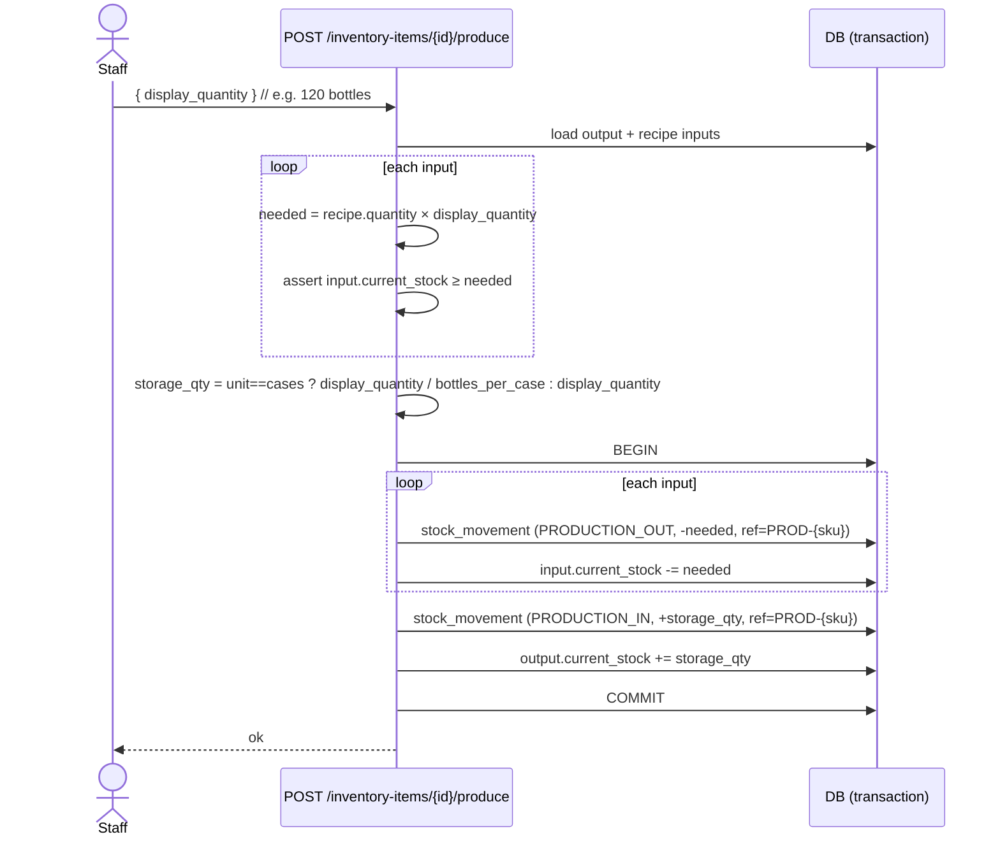
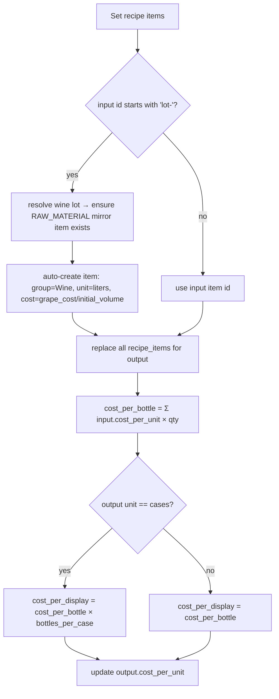

# Flow 04 — Inventory Production (from Recipe / BOM)

Produce a quantity of a finished/semi-finished item by consuming its recipe
inputs. Source: `inventory.actions.ts → produceItem`, `recipe.actions.ts`.

## Preconditions
- Output item has a recipe (`recipe_items` with `output_id = item`).
- Every input has sufficient `current_stock`.

## Sequence

## Recipe definition & costing (`PUT /inventory-items/{id}/recipe`)

## Side effects
- Inputs: **`PRODUCTION_OUT`** movements (negative) + stock decremented.
- Output: **`PRODUCTION_IN`** movement (positive) + stock incremented.
- Setting a recipe **auto-recomputes and stores** the output's `cost_per_unit`
  (which later feeds the order COGS snapshot in Flow 01).
- Wine-lot recipe inputs **auto-create** a `RAW_MATERIAL` inventory mirror item
  (`sku = lot_number`, `group = Wine`) — the only place inventory items are
  auto-created from the cellar side.

## Unit/case arithmetic
- Output stored in cases: `display_quantity` (bottles) is divided by
  `bottles_per_case` for storage; movement records the storage quantity.
- Recipe `quantity` is expressed **per bottle**; multiply by `display_quantity`
  (bottles) to get consumption.

## Constraints
- Recipe input rule: `output_id != input_id`; no duplicate inputs; `(output_id,input_id)` unique.
- `getAvailableInputs` restricts eligible inputs by output category
  (`SEMI_FINISHED` may only consume `RAW_MATERIAL`) and surfaces `READY`/`AGING`
  wine lots with `current_volume > 0` as virtual inputs.