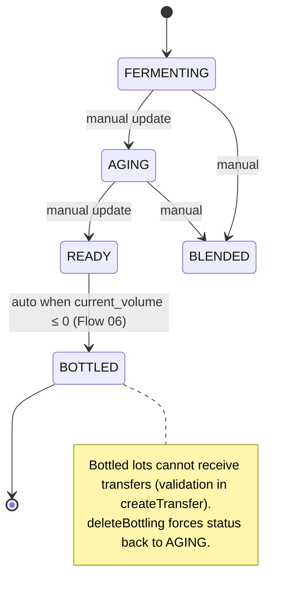
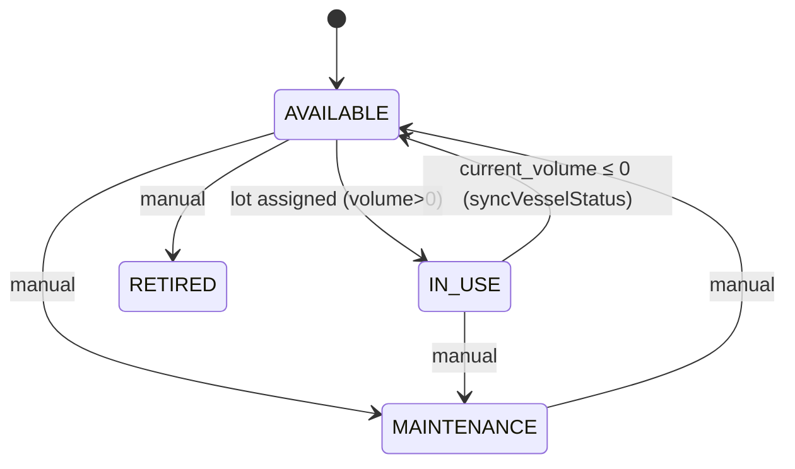
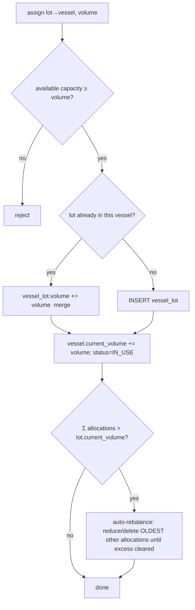

# Flow 05 — Wine Lot Lifecycle, Vessel Allocation & Transfers

How a wine lot is created, placed into vessels, moved around, and progresses
through its lifecycle. Source: `cellar.actions.ts`. All actions require
`ADMIN` or `CELLAR`.

## 5.1 Lot creation

```mermaid
sequenceDiagram
    actor Cellar
    participant API as POST /wine-lots
    participant DB as DB (transaction)

    Cellar->>API: { name, grape_variety, vintage, initial_volume, grape_price_per_kg?, harvest_weight_kg?, vessel_id? }
    API->>DB: lot_number = LOT-{year}-{NNN}   (per-tenant sequence)
    API->>API: grape_cost = grape_price_per_kg × harvest_weight_kg (if both)
    API->>DB: INSERT wine_lot (status=FERMENTING, current_volume=initial_volume)
    opt vessel_id given
        API->>DB: INSERT vessel_lot (volume=initial_volume)
        API->>DB: vessel.current_volume += initial_volume; vessel.status=IN_USE
    end
    API-->>Cellar: { lot_id, lot_number }
```

## 5.2 Lifecycle state machine



Vessel status is largely automatic:



## 5.3 Assign lot to vessel (`POST /wine-lots/{id}/assign-vessel`)



## 5.4 Transfers — RACK / BLEND / SPLIT (`POST /cellar-transfers`)

```mermaid
sequenceDiagram
    actor Cellar
    participant API as POST /cellar-transfers
    participant DB as DB (transaction)

    Cellar->>API: { type: RACK|BLEND|SPLIT, from_lot_id, to_lot_id, volume_liters, from_vessel_id?, to_vessel_id? }
    API->>API: assert from_lot ≠ to_lot; from_lot.current_volume ≥ volume; to_lot.status ≠ BOTTLED
    API->>DB: INSERT cellar_transfer
    API->>DB: from_lot.current_volume -= volume; to_lot.current_volume += volume
    opt from_vessel_id
        API->>DB: reduce/delete from_vessel's vessel_lot; vessel.current_volume -= volume; sync status
    end
    opt to_vessel_id
        API->>DB: create/increment to_vessel's vessel_lot; vessel.current_volume += volume; status=IN_USE
    end
```

- **RACK** = move wine between vessels (clarify/separate).
- **BLEND** = combine into a destination lot.
- **SPLIT** = divide a lot across destinations.
- `DELETE /cellar-transfers/{id}` fully reverses volumes and vessel allocations.

## 5.5 Attachments to a lot (audit-only, no volume change)
- **Additions** (`/additions`): SO2/yeast/fining etc.; computes `total_cost = quantity × cost_per_unit` — feeds bottling COGS.
- **Analyses** (`/analyses`): pH, TA, VA, alcohol, RS, free/total SO2, Brix, temp, density.
- **Tasting notes** (`/tasting-notes`): appearance/nose/palate/overall, score 0–100.

## 5.6 Deleting a lot (`DELETE /wine-lots/{id}`)
Restores all vessel volumes, cascades additions/analyses/tasting notes/vessel_lots,
manually deletes transfers, and cleans up the auto-created `RAW_MATERIAL` mirror
item (hard delete if unused, deactivate if it has order references). Bottled
inventory stock is **not** reversed.