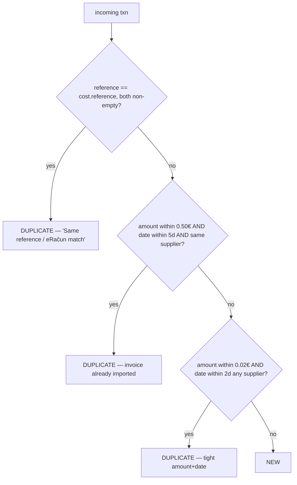

# Flow 07 — Bank Statement Import → Costs

Import a bank statement (often via AI parse, Flow in `07-integrations`), detect
duplicates, match suppliers/invoices, and create cost records. Source:
`costs.actions.ts` (`checkDuplicateTransactions`, `importBankStatementAsCosts`,
`createCostFromBankTransaction`, `matchBankTransaction`). ADMIN only.

## End-to-end

```mermaid
sequenceDiagram
    actor Admin
    participant AI as POST /ai/parse-bank-statement
    participant Dup as POST /bank-transactions/check-duplicates
    participant Imp as POST /bank-transactions/import-as-costs
    participant DB

    Admin->>AI: statement image/PDF
    AI-->>Admin: { transactions:[{date, description, amount, type, counterparty, reference, category}] }
    Admin->>Dup: transactions[]
    Dup->>DB: load costs (last 90d) + suppliers
    loop each txn
        Dup->>Dup: fuzzy-match supplier by counterparty
        Dup->>Dup: suggest category (determineCategory / fallback)
        Dup->>Dup: 3-level duplicate check (below)
    end
    Dup-->>Admin: annotated rows {isDuplicate, matchedCostId, matchReason, suggestedCategory, matchedSupplier}
    Admin->>Admin: deselect duplicates, adjust categories
    Admin->>Imp: chosen transactions[] (+items?, invoiceUrl?)
    loop each txn
        Imp->>DB: match supplier; try match unlinked INCOMING e-invoice (amount±0.02 + sender)
        Imp->>DB: INSERT cost (total=|amount|, status=PENDING, category)
        opt items
            Imp->>DB: INSERT cost_items; updateSupplierPriceList(supplier, items)
        end
        opt invoiceUrl
            Imp->>DB: INSERT cost_attachment (type=invoice)
        end
        opt e-invoice matched
            Imp->>DB: e_invoice.cost_id = cost.id
        end
    end
    Imp-->>Admin: { count, matched, withItems }
```

## Duplicate detection (3 levels)



## Supplier fuzzy match (counterparty → supplier)
Match if either name contains the other (case-insensitive) OR they share a word
of ≥3 chars. On a match, the supplier id (and learned category) is attached.

## Category inference (`determineCategory`)
Priority: (1) supplier's most frequent past category → (2) line-item keyword map
(wine/grape→Raw Materials, label/bottle/cork→Packaging, delivery→Transport,
electric/gas→Utilities, …) → (3) sender-name patterns (telecom→Utilities,
DHL/UPS/Pošta→Transport, supermarket→Food & Drink) → (4) default `Supplies`
(or `Revenue`/`Other` by DEBIT/CREDIT for bare bank rows).

## Alternative single-transaction paths
- `POST /bank-transactions/import` — bulk-insert raw rows only (returns `import_batch_id`), match later.
- `POST /bank-transactions/{id}/create-cost` — convert one stored txn to a cost (requires it be unmatched).
- `POST /bank-transactions/{id}/match` — link an existing txn to an existing cost (1:1) and mark `is_matched`.

## Side effects
- New `costs` (status **PENDING**), optional `cost_items` and `cost_attachments`.
- Supplier **price list learning**: upsert `supplier_price_items` on `(supplier, description)`.
- e-invoice linkage when amount+sender match; transactions flagged `is_matched`.