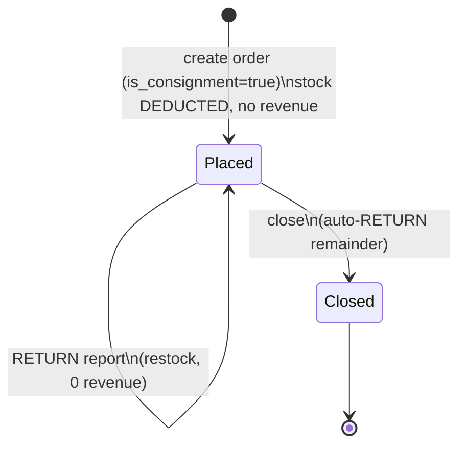

# Flow 10 — Consignment (Komisija) Orders 🆕

Croatian *komisijska prodaja*: the winery **places** goods at a customer (a bar,
shop, restaurant). The goods physically leave the warehouse, but ownership — and
**revenue** — is only recognized as the customer actually **sells** them.
Anything unsold is **returned**. Source: `consignment.actions.ts`,
`customer-consignment.actions.ts`.

## Concepts

| Term | Meaning |
|---|---|
| **Placement** | A consignment order (`orders.is_consignment = true`). Stock is deducted (goods left the building) but it is **not** a sale. |
| **Sell-through** | A `consignment_reports` row, `kind = SALE` — what the customer reports sold. Recognizes revenue + COGS. |
| **Return** | A `consignment_reports` row, `kind = RETURN` — unsold goods coming back. Restocks; zero revenue. |
| **Outstanding** | `placed − sold − returned`, tracked **in bottles** even when placed in cases. |
| **Close** | Auto-return the remainder and set `consignment_closed_at`. |

All quantities reconcile **in single bottles** (`order_item.quantity ×
bottles_per_case` when the line was placed in cases). Each placement line carries
its own per-bottle price and per-bottle COGS, snapshotted at placement.

## Lifecycle



## Sequence — sale & return

```mermaid
sequenceDiagram
    actor Staff
    participant Sum as GET /orders/{id}/consignment
    participant Rep as POST .../consignment/sale|return
    participant DB as DB (transaction)

    Staff->>Sum: open reconciliation panel
    Sum->>DB: tally placed / sold / returned / remaining (bottles)
    Sum-->>Staff: per-line summary + report history

    Staff->>Rep: SALE { items:[{order_item_id, quantity, unit_price?}], note? }
    Rep->>DB: INSERT consignment_report (kind=SALE) + items
    Note over DB: revenue = Σ(qty×unit_price)\nCOGS = Σ(qty×cost_per_bottle)\nNO stock change (already deducted at placement)

    Staff->>Rep: RETURN { items:[{order_item_id, quantity}], note? }
    Rep->>DB: INSERT consignment_report (kind=RETURN) + items (price/total=0)
    Rep->>DB: StockLedger MANUAL_IN (+qty → storage unit); current_stock += 
```

## Revenue & profit
- A consignment order contributes **€0** to sales until SALE reports exist.
- `SALE`: `revenue = Σ(quantity × unit_price)`, `COGS = Σ(quantity × cost_per_bottle)`,
  `gross_profit = revenue − COGS`, `margin% = gross_profit / revenue`.
- `RETURN`: `unit_price = total = 0`; only effect is restock.
- Customer-level views (`/customers/{id}/consignment`) aggregate across **all** of
  that customer's placements and allocate sales/returns **FIFO** (oldest placement
  first), so per-bottle price/cost come from the right placement.

## Deletion / edit interaction
- Deleting a consignment **order** (or a line) restores **only the unsold
  remainder** (`placed − sold − returned`) — sold goods are gone; returns were
  already restocked.
- Reuse the same `StockLedger` deduction/restoration service as flows 01/02; the
  only consignment-specific logic is the reports + the "remainder only" rule.

## Backend build notes
- Tables: `consignment_reports`, `consignment_report_items` (see data model §3.4).
- Endpoints: `GET/POST /orders/{id}/consignment*` (order-level) and
  `/customers/{id}/consignment*` (customer-level, FIFO) — see API reference.
- Keep bottle-normalization (`× bottles_per_case`) in one helper; store
  consignment-item quantities **in bottles**.
- Wrap each report in a transaction; RETURN must restock atomically with the report.
